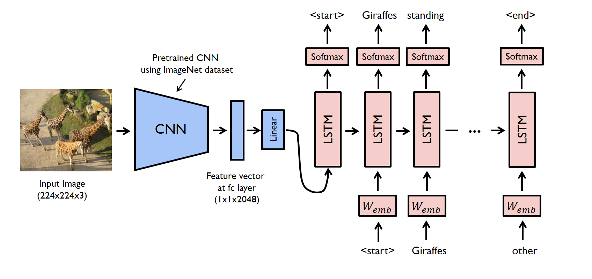

# image_captioning

use InceptionV3 and LSTM model for making the caption in images, this demo will apply the trained model for:

- build machine learning server predict caption for posted image

- predict caption in realtime

[./imgs/demo.gif]

**Summary**

- Workflow

we use pretrained model `inceptionV3` with `imageNet` to extract the *feature vector* `(2048,)` convert to a vector `(256,)`, sum it with `LSTM` output to predict the next word in the sentence

- Model architecture

**Required libraries**

- Flask
- OpenCV
- Tensorflow
- argparse
- pickle

**OS-system**
Linux Ubutu 18.04

**Download assets**

- dataset included image and 5 caption each image [Flickr8k-dataset](https://www.kaggle.com/datasets/adityajn105/flickr8k)
- word embedding [GloVe_6B_Kaggle](https://www.kaggle.com/datasets/anindya2906/glove6b?select=glove.6B.200d.txt) , [GloVe_Stanford](https://nlp.stanford.edu/projects/glove/)

### References

[nntuan8](https://github.com/Locchuong96/Machine-Learning/blob/main/Courses/DL_Tutorial/L15/Automatic%20Image%20Captioning.ipynb)

[image caption](https://github.com/divyanshj16/Image-Captioning)

[image-caption-using-tensor-flow](https://www.kaggle.com/code/priyankasharma251997/image-caption-using-tensor-flow)

[bow-vs-skip-gram](https://www.baeldung.com/cs/word-embeddings-cbow-vs-skip-gram)

[word-embedding](https://lilianweng.github.io/posts/2017-10-15-word-embedding/)
